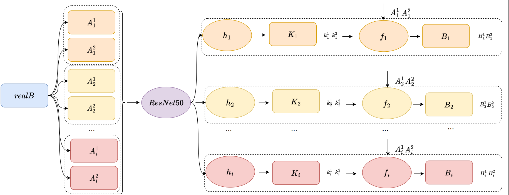
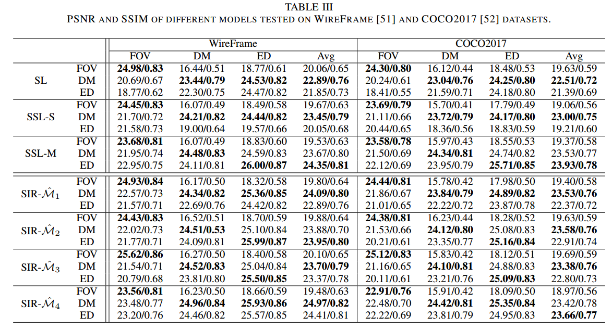
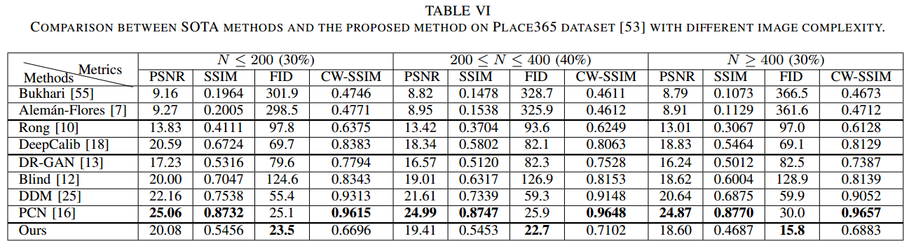
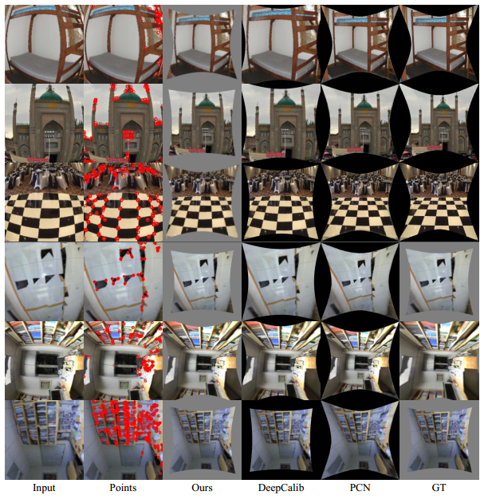
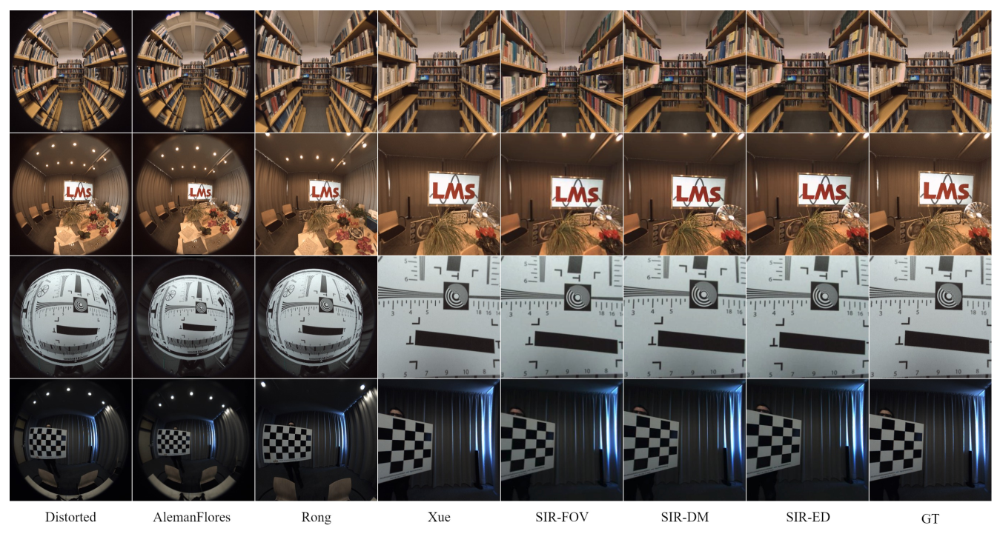

<h1 align="center">SIR: Self-supervised Image Rectification via Seeing the Same Scene from Multiple Different Lenses
</h1>

<p align="center">
<a href="https://arxiv.org/abs/2011.14611">.svg" ></a>
</p>


<h4 align="center">This is the official repository of the paper <a href="https://arxiv.org/abs/2011.14611">SIR</a>.</h4>
<h5 align="center"><em>Jinlong Fan, Jing Zhang, Dacheng Tao</em></h5>

<p align="center">
  <a href="##Introduction">Introduction</a> |
  <a href="#Method">Method</a> |
  <a href="#Results">Results</a> |
  <a href="#Statement">Statement</a>
</p>

## Introduction

<p align="justify">
Deep learning has demonstrated its power in image rectification by leveraging the representation capacity of deep neural networks via supervised training based on a large-scale synthetic dataset. However, the model may overfit the synthetic images and generalize not well on real-world fisheye images due to the limited universality of a specific distortion model and the lack of explicitly modeling the distortion and rectification process. In this paper, we propose a novel <strong>self-supervised image rectification (SIR)</strong> method based on an important insight that the rectified results of distorted images of a same scene from different lens should be the same. Specifically, we devise a new network architecture with a shared encoder and several prediction heads, each of which predicts the distortion parameter of a specific distortion model. We further leverage a differentiable warping module to generate the rectified images and re-distorted images from the distortion parameters and exploit the intra- and inter-model consistency between them during training, thereby leading to a self-supervised learning scheme without the need for ground-truth distortion parameters or normal images. Experiments on synthetic dataset and real-world fisheye images demonstrate that our method achieves comparable or even better performance than the supervised baseline method and representative state-of-the-art methods. Self-supervised learning also improves the universality of distortion models while keeping their self-consistency.
</p>


## Method

<p align="justify"> 
Unlike existing supervised methods, the proposed self-supervised method does not need any ground truth distortion parameters, distortion field, or the normal image to train the network. The 
framework is illustrated in the above figure. During training, $s$ distorted images are synthesized from one normal image $realB$ using $d$ distortion models, so totally there will be $d ∗ s$ 
images in each batch. For clarity, we only show two samples for each model here, as in our experiment setting. Each head shares the same distortion model (in the same color). The input images are 
fed into a shared encoder, i.e. ResNet-50. Next, the prediction head for each model (i.e. $h_i$) predicts the distortion parameters (i.e. $K_i$) under 
that distortion model (i.e. $D_i$) accordingly. Finally, the forward warping module (i.e. $f_i$) generates the rectified images (e.g. $B_i$). $A^1_i$ means the sample is under distortion model $D_i$ 
with 
parameter $k^1$. Similarly, $k_i^1$ is the distortion parameter $k^1$ defined under model $D_i$. $B_i^1$ is the rectified result of $A^1_i$.
</p>


Although there is no limit of the number of distortion models and distorted images in each group in our framework, we choose $d=3$ typical models, \ie $D_1$ - the <strong> FOV </strong> distortion model (denoted as 'FOV'), $D_2$ - the one parameter <strong>D</strong>ivision <strong>M</strong>odel (denoted as 'DM'), and $D_3$ - the  <strong>E</strong>qui<strong>D</strong>istant distortion model (denoted as 'ED'), and synthsize $s=2$ samples for each model in our setting. Each of the selected models has a single parameter and an invertible forward (distorted$\rightarrow$normal) warping function and differentiable backward (normal$\rightarrow$distorted) function.

## Results

The quantitative results and the visual results are given below. Without any ground truth supervision, SIR achieves comparable or even better results than typical traditional methods and SOTAs of 
deep learning methods. More results and details about our experiment and setting can be found in the paper.







## Statement

If you are interested in our work, please consider citing the following:
```
@article{jfan2021sir,
  title={SIR: Self-supervised Image Rectification via Seeing the Same Scene from Multiple Different Lenses},
  author={Jinlong Fan and Jing Zhang and Dacheng Tao},
  journal={ArXiv},
  year={2021},
  volume={abs/2011.14611}
}

```
